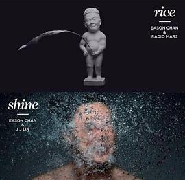

<h1 style="text-align:center;">主页</h1>

 

<h2 style="text-align:center;">🐳书影🐳</h2>

<!-- MOVIE_TRACKER_START --><!-- REMOVE_MARK --> <table style="text-align:center;" align="center"> <tr> <th>名称</th> <th>海报</th> <th>时间</th> </tr> <tr> <td>在看间谍过家家 Part 2</td> <td><table style="text-align:center;" align="center"><tr> <td width="80px"></td> </tr></table></td> <td>Wed, 09 Nov 2022 17:35:23 GMT</td> </tr> <tr> <td>最近在读失落的卫星</td> <td><table style="text-align:center;" align="center"><tr> <td width="80px"></td> </tr></table></td> <td>Wed, 09 Nov 2022 17:26:52 GMT</td> </tr> <tr> <td>看过孔子</td> <td><table style="text-align:center;" align="center"><tr> <td width="80px"></td> </tr></table></td> <td>Wed, 09 Nov 2022 17:20:10 GMT</td> </tr> <tr> <td>听过琵琶相</td> <td><table style="text-align:center;" align="center"><tr> <td width="80px"></td> </tr></table></td> <td>Wed, 09 Nov 2022 08:11:01 GMT</td> </tr> <tr> <td>听过rice & shine</td> <td><table style="text-align:center;" align="center"><tr> <td width="80px"></td> </tr></table></td> <td>Tue, 08 Nov 2022 09:10:51 GMT</td> </tr> <tr> <td>听过四季</td> <td><table style="text-align:center;" align="center"><tr> <td width="80px"></td> </tr></table></td> <td>Tue, 08 Nov 2022 02:25:12 GMT</td> </tr> <tr> <td>听过自定义</td> <td><table style="text-align:center;" align="center"><tr> <td width="80px"></td> </tr></table></td> <td>Mon, 07 Nov 2022 18:47:56 GMT</td> </tr> <tr> <td>听过皇后大道东</td> <td><table style="text-align:center;" align="center"><tr> <td width="80px"></td> </tr></table></td> <td>Mon, 07 Nov 2022 14:01:09 GMT</td> </tr> <tr> <td>听过爱你伍佰年</td> <td><table style="text-align:center;" align="center"><tr> <td width="80px"></td> </tr></table></td> <td>Mon, 07 Nov 2022 09:31:32 GMT</td> </tr> <tr> <td>听过Get A Life 演唱会</td> <td><table style="text-align:center;" align="center"><tr> <td width="80px"></td> </tr></table></td> <td>Sun, 06 Nov 2022 02:32:09 GMT</td> </tr> </table><!-- MOVIE_TRACKER_END -->

 

<h2 style="text-align:center;">🐳足迹🐳</h2>

  

  

 

<h2 style="text-align:center;">链接🔗</h2>

> 博客样式参考<a target="_blank" href="https://scottcgi.github.io/">scott.cgi</a>
>
> <a target="_blank" href="https://icons8.com/icon/2Sk9rPFlL-fu/zhihu">Zhihu</a> icon by <a target="_blank" href="https://icons8.com">Icons8</a>
>
> <a target="_blank" href="https://icons8.com/icon/16318/github">GitHub</a> icon by <a target="_blank" href="https://icons8.com">Icons8</a>
