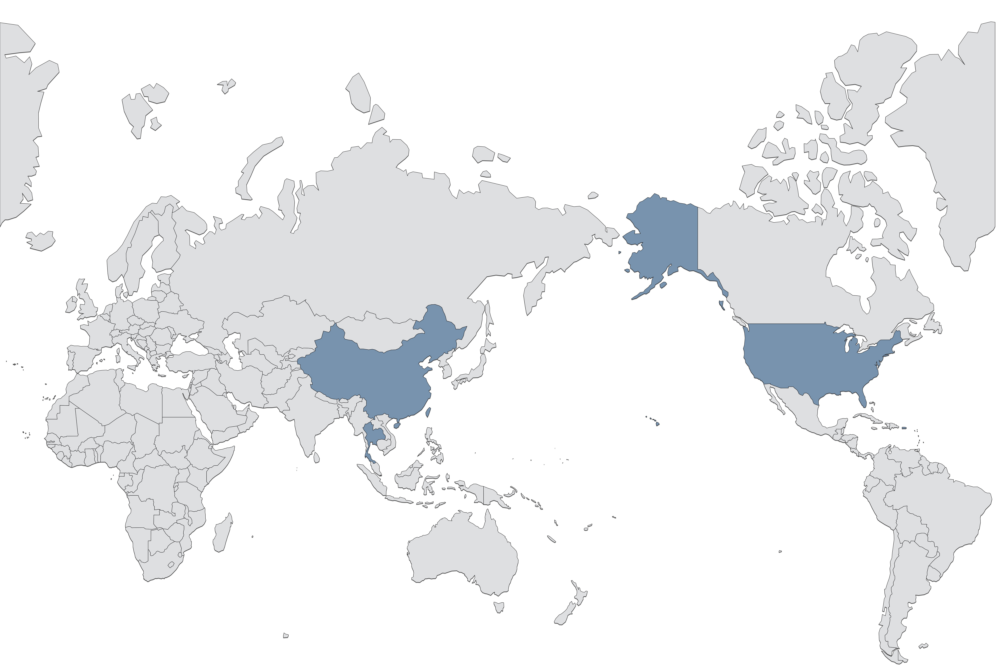

<h1 style="text-align:center;">主页</h1>

 

<h2 style="text-align:center;">🐳书影🐳</h2>

<!-- MOVIE_TRACKER_START --><!-- REMOVE_MARK --> <table style="text-align:center;" align="center"> <tr> <th>名称</th> <th>海报</th> <th>时间</th> </tr> <tr> <td>想读失落的卫星</td> <td><table style="text-align:center;" align="center"><tr> <td width="80px"></td> </tr></table></td> <td>Sun, 06 Nov 2022 05:50:35 GMT</td> </tr> <tr> <td>听过Get A Life 演唱会</td> <td><table style="text-align:center;" align="center"><tr> <td width="80px"></td> </tr></table></td> <td>Sun, 06 Nov 2022 02:32:09 GMT</td> </tr> <tr> <td>看过三十九级台阶</td> <td><table style="text-align:center;" align="center"><tr> <td width="80px"></td> </tr></table></td> <td>Sun, 06 Nov 2022 02:12:27 GMT</td> </tr> <tr> <td>听过Etupirka~Best Acoustic~</td> <td><table style="text-align:center;" align="center"><tr> <td width="80px"></td> </tr></table></td> <td>Mon, 31 Oct 2022 12:59:58 GMT</td> </tr> <tr> <td>最近在读Forecasting</td> <td><table style="text-align:center;" align="center"><tr> <td width="80px"></td> </tr></table></td> <td>Fri, 28 Oct 2022 08:44:00 GMT</td> </tr> <tr> <td>想看间谍过家家 Part 2</td> <td><table style="text-align:center;" align="center"><tr> <td width="80px"></td> </tr></table></td> <td>Fri, 21 Oct 2022 11:58:51 GMT</td> </tr> <tr> <td>最近在读统计学习方法（第2版）</td> <td><table style="text-align:center;" align="center"><tr> <td width="80px"></td> </tr></table></td> <td>Tue, 11 Oct 2022 14:59:08 GMT</td> </tr> <tr> <td>读过中国历代政治得失</td> <td><table style="text-align:center;" align="center"><tr> <td width="80px"></td> </tr></table></td> <td>Mon, 10 Oct 2022 17:27:24 GMT</td> </tr> <tr> <td>读过杀死一只知更鸟</td> <td><table style="text-align:center;" align="center"><tr> <td width="80px"></td> </tr></table></td> <td>Fri, 07 Oct 2022 14:12:00 GMT</td> </tr> <tr> <td>读过明朝出了个张居正</td> <td><table style="text-align:center;" align="center"><tr> <td width="80px"></td> </tr></table></td> <td>Sun, 02 Oct 2022 02:58:48 GMT</td> </tr> </table><!-- MOVIE_TRACKER_END -->

 

<h2 style="text-align:center;">🐳足迹🐳</h2>

  

  

 

<h2 style="text-align:center;">链接🔗</h2>

> 博客样式参考<a target="_blank" href="https://scottcgi.github.io/">scott.cgi</a>
>
> <a target="_blank" href="https://icons8.com/icon/2Sk9rPFlL-fu/zhihu">Zhihu</a> icon by <a target="_blank" href="https://icons8.com">Icons8</a>
>
> <a target="_blank" href="https://icons8.com/icon/16318/github">GitHub</a> icon by <a target="_blank" href="https://icons8.com">Icons8</a>
